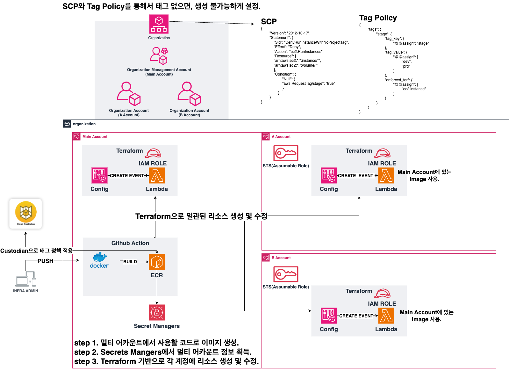
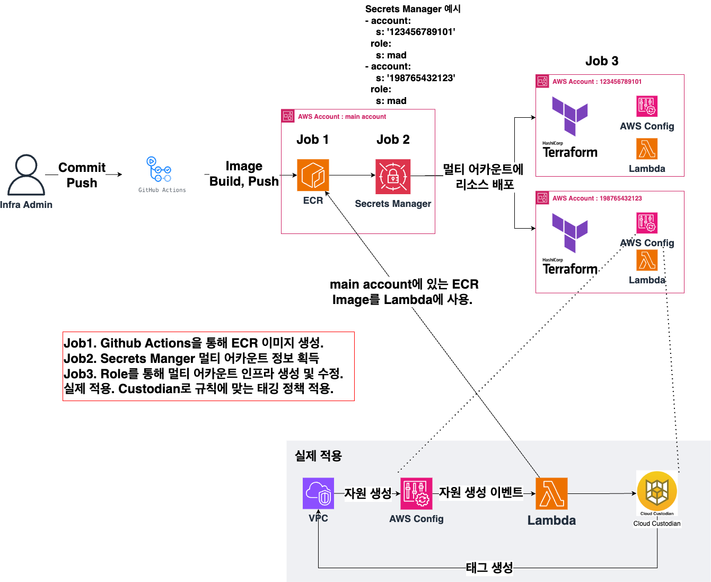
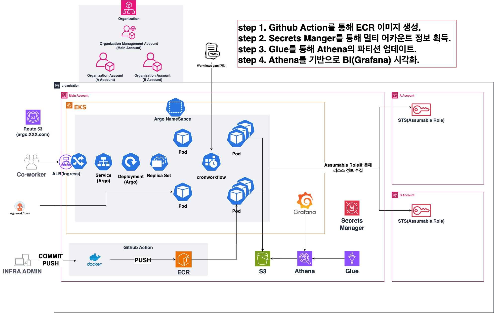
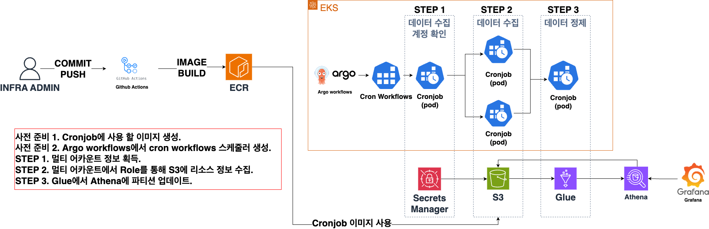
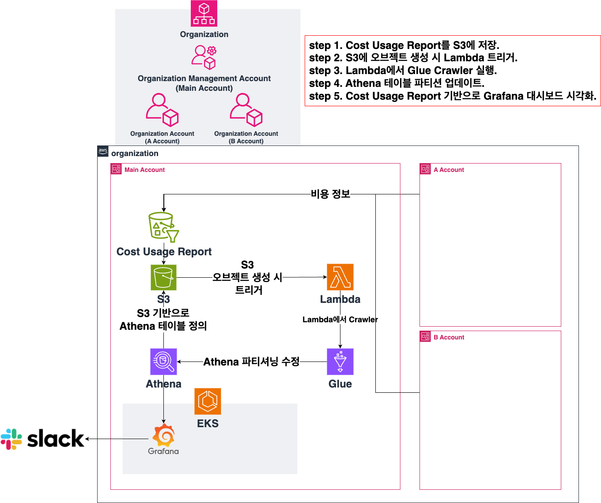
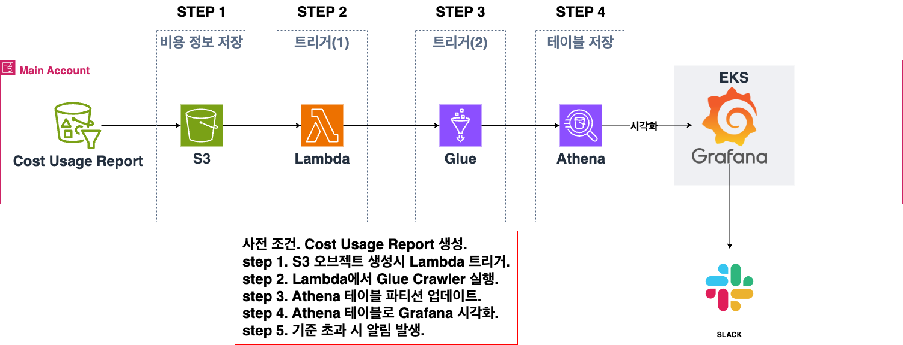
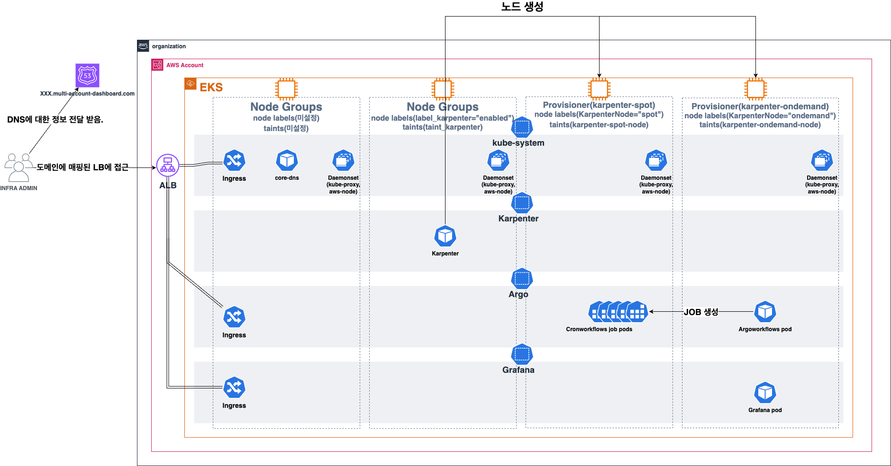

# MAD Project(Muti Account Dashboard Project)

### 목차🗂

[프로젝트개요](https://github.com/gaeun-project/eks-project/tree/dev#%ED%94%84%EB%A1%9C%EC%A0%9D%ED%8A%B8-%EA%B0%9C%EC%9A%94)

[프로젝트 배경](https://github.com/gaeun-project/eks-project/tree/dev#%ED%94%84%EB%A1%9C%EC%A0%9D%ED%8A%B8-%EB%B0%B0%EA%B2%BD)

[프로젝트 설명](https://github.com/gaeun-project/eks-project/tree/dev#%ED%94%84%EB%A1%9C%EC%A0%9D%ED%8A%B8-%EC%84%A4%EB%AA%85)

[프로젝트 아이디어 및 구현 방법](https://github.com/gaeun-project/eks-project/tree/dev#%ED%94%84%EB%A1%9C%EC%A0%9D%ED%8A%B8-%EC%95%84%EC%9D%B4%EB%94%94%EC%96%B4-%EB%B0%8F-%EA%B5%AC%ED%98%84-%EB%B0%A9%EB%B2%95)

[기술 스택](https://github.com/gaeun-project/eks-project/tree/dev#%EA%B8%B0%EC%88%A0-%EC%8A%A4%ED%83%9D)

[아키텍처 및 흐름도](https://github.com/gaeun-project/eks-project/tree/dev#%EC%95%84%ED%82%A4%ED%85%8D%EC%B2%98-%EB%B0%8F-%ED%9D%90%EB%A6%84%EB%8F%84)

[느낀 점](https://github.com/gaeun-project/eks-project/tree/dev#%EB%8A%90%EB%82%80-%EC%A0%90)

## 프로젝트 소개

**기간 :**

- 2023.03~2023.09

**인원 :**

* 김가은👩🏻

## 프로젝트 개요

* **회사에서 경험한 리소스 관리와 태깅관리 관련한 내용을 담고 있습니다.**
* **회사에서 겪은 리소스 및 태깅 관리의 문제점을 해결하고자 시작한 프로젝트입니다**

## 프로젝트 배경

* **예산 관리를 위해서는 리소스 관리와 태깅 관리가 필수적입니다.**
* **회사에서는 이를 위한 플랫폼이 있지만 큰 단점이 있습니다.**
* **각각의 어카운트 마다 플랫폼에 직접 들어가서 진행을 해야 한다라는 점입니다.**
* **그래서 이러한 단점을 해결하기 위한 아이디어를 프로젝트로 활용했습니다.**

## 프로젝트 설명

* **해당 프로젝트는 크게 멀티 어카운트에서 리소스 관리와 태깅 관리에 초점이 맞춰져 있습니다.**
* **회사의 불편함을 개선하기 위해 적절한 오픈소스와 방법론을 프로젝트에 도입했습니다.**

## 프로젝트 아이디어 및 구현 방법

### **문제점 및 아이디어:**

* **문제점 1**
  * **태그를 강제화 할 수 있는 방안이 없어서, 태깅 관리의 일관성이 없음**
* **아이디어 ( 태그 관리 최적화 )**
  * **SCP 사용 (Org Level에서 정책 기반 제어 + 필수 태그 값 사용 강제화)**
  * **이미 생성된 리소스의 경우, 리소스 태그 현황을 스프레드 시트로 확인**
* **문제점 2**
  * **여러 어카운트에서 리소스 현황을 관리가 되지 않아 확인이 어려움**
* **아이디어 ( 중앙화된 리소스 시각화 )**
  * **여러 어카운트의 정보를 중앙화 된 곳에 수집, BI 툴을 이용해서 시각화.**
* **문제점 3**
  * **비용이 갑자기 증가하는 Anomaly Detection 리소스를 파악하기 어려움**
* **아이디어 ( 비용 얼럿 )**
  * **Cost Usage Report의 정보를 기반으로 얼럿 전송**

### **구현 방법**

* **태그 관리 최적화 :**
  * **새로 생성하는 리소스**
    * **SCP와 Tag Policy를 태깅 정책 적용.**
    * **Cloud custodian를 이용한 태깅 설정.**
  * **기존 리소스**
    * **GCP의 구글 스프레드 시트를 이용한 리소스의 태깅 확인**
* **중앙화된 리소스 시각화 :**
  * **리소스들의 데이터를 수집하기 위해서 Argo Workflows 및 BI툴 사용**
* **비용 얼럿 :**
  * **Athena와 Glue를 이용한 비용 데이터 저장 및 Slack을 이용한 알림**

## 기술 스택

* **AWS :**

Config, ECR, EKS, Lambda, S3, Athena, Route53, ACM, IAM, ALB, Secrets Manager

* **Open Source :**

Grafana, Karpenter, Helm, HelmFile, Terraform, Custodian, Argo workflows

* **ETC:**

Github Actions, Slack, Google Sheets

## 아키텍처 및 흐름도

### **태그 관리 최적화(아키텍처)**

### 태그 관리 최적화(흐름도)

---

## 중앙화된 리소스 시각화(아키텍처)**:**

### 중앙화된 리소스 시각화(**흐름도):**

---

## **비용 얼럿(아키텍처) :**

### 비용 얼럿(흐름도) :

---

## 프로젝트의 간단한 EKS 아키텍처

## 느낀 점

**비용 이슈**

* 개인 계정에서 진행하다 보니 과도한 비용 발생.
* 어떻게 하면 비용 최적화 혹은 요금 폭탄 맞지 않을까 생각.
* 이때, 비용 관리 아키텍처 적용 및 노드 최적화를 위해 Karpenter와 Spot 노드 적용.

**병렬 처리 이슈**

* Data 수집 시, 현재는 3개의 계정을 가지고 진행했지만, 1000개 혹은 그 이상이 있다고 가정하고 진행.
* 이때, 직렬로 진행할 경우 원하는 목표치 달성 불가능 예상.
* 이를 해결하기 위해 Argo Workflows로 병렬처리 적용.

**관리 이슈**

* 처음에는 AWS 셋팅 시 콘솔에서 작업을 진행했지만, 일관성과 복잡성으로 인해 Terraform으로 설정.
  그 후 Terraform 모듈을 통해 확장성 고려.
* 쿠버네티스에서 manifest로 관리 시 버전관리가 어려운 점을 확인하여 Helm과 HelmFile 적용.
* 명령어 하나로 관리하는 것이 편의성이 늘어나서 Makefile 적용.
* 시크릿 정보 관리하기 위해 Secrets Manager 사용.

**정책 이슈**

* 정책이 강제화 되지 않으니 human error가 발생.
* 이를 위해, Organization LEVEL에서 SCP 정책 적용 및 추가적인 정책컨트롤은 Custodian을 이용.
